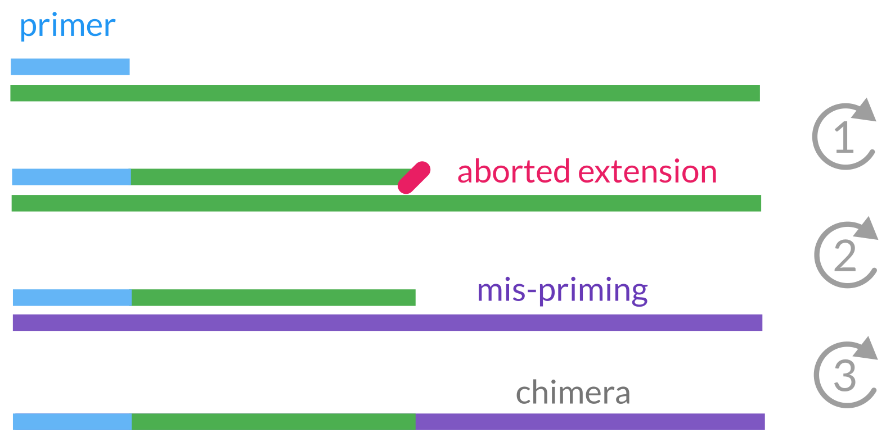
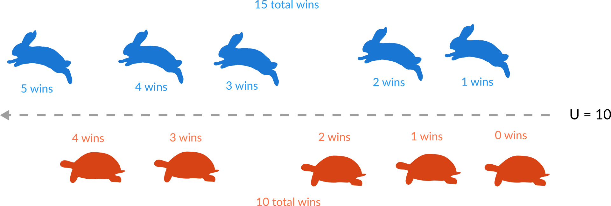

<!-- .slide: data-background="#3F51B5" class="dark" -->

# Qiime II for 16S rDNA

### Sean M. Gibbons and Christian Diener


2018-12-04<br>
*CCMB workshop*

---

Created ~2010 during the Human Microbiome Project (2007 - 2016) under leadership
of Greg Caporaso and Rob Knight.

---

## What is Qiime?

> QIIME 2 is a powerful, extensible, and decentralized microbiome
analysis package with a focus on data and analysis transparency.

*Q*uantitative *i*nsights *i*nto *M*icrobial *E*cology

---

## So what is it really?

In its essence Qiime is a set of *commands* to transform microbiome *data* into
*intermediate* outputs and *visualization*.


Its major mode of use is via the *command line*.

---

*Qiime 2* was introduced 2016 and improves on Qiime 1 based on the experiences
during the HMP.

Major changes:

- integrated tracking of *data provenance*
- semantic *type system*
- extendable *plugin* system
- multiple *user interfaces* (in progress)

---

## Where to find help?

Qiime 2 comes with a lot of help starting from https://qiime2.org such
as [tutorials](https://docs.qiime2.org/2018.11/tutorials/),
[general documentation](https://docs.qiime2.org/2018.11/) and a
[user forum](https://forum.qiime2.org/) to ask questions.

---

## Artifacts, actions and visualizations

Qiime 2 manages *artifacts* which is basically intermediate data that is fed
to *actions* to either produce other artifacts or *visualizations*.


---

## Remember

Artifacts can be *intermediate steps*, but Visualizations are *end points*
meant for human consumption :point_up:.

---

<!-- .slide: data-background="#2962FF" class="dark" -->

# Walkthrough I

## Analyzing the microbial composition in colorectal cancers

---

## The setup

Qiime 2 currently only has native support for Mac and Linux.

We will use a server with the latest Qiime 2 installed.

You will get a user name (let's assume it's `user`) and password.

----

Goal for now: connect to the server via a terminal.

There might be some minor set up steps :point_down:

----

<!-- .slide: data-background="#00897B" class="dark" -->

## Windows: Install Putty and WinSCP

----

### Putty

To connect to the server we will need a SSH client. You can download Putty
at https://www.chiark.greenend.org.uk/~sgtatham/putty/latest.html
(most likely the 64bit version).

Run the downloaded installer and you are set.

If you open Putty it will ask you for a server (s167.ok.ubc.ca) your user
name and password and will connect you to the server.

----

### WinSCP

`WinSCP` will allow you to transfer files between you computer and the server.

Download it at https://winscp.net/eng/download.php .

After installing and running it will ask you for the same info as before. Choose
SFTP or SCP as the protocol (default) and provide the server (s167.ok.ubc.ca)
your user and password.

----

<!-- .slide: data-background="#00897B" class="dark" -->

## Mac or Linux: Install nothing :stuck_out_tongue:

But you will need to open a terminal...

----

Type "terminal" in the application menu.

You can connect to the server with

```bash
ssh user@s167.ok.ubc.ca
```

and transfer files using `rsync`

```
rsync user@s167.ok.ubc.ca:~/file.txt .
```

----

<!-- .slide: data-background="#00897B" class="dark" -->

# How do I install Qiime 2 on my own equipment?

https://docs.qiime2.org/2018.11/install/

----

## Mac or Linux: use conda

1. Install miniconda -> https://conda.io/miniconda.html
2. Get the conda environment file for [Mac](https://data.qiime2.org/distro/core/qiime2-2018.11-py35-osx-conda.yml)
   or [Linux](https://data.qiime2.org/distro/core/qiime2-2018.11-py35-linux-conda.yml)
3. Set up the Qiime 2 environment and activate it

```bash
conda env create -n qiime2-2018.11 --file qiime2-2018.11-py35-osx-conda.yml
source activate qiime2-2018.11
```

----

## Windows: use docker

No native support but you can run it with Docker (virtual machine alternative).

See https://store.docker.com/editions/community/docker-ce-desktop-windows.

With docker you can get the Qiime 2 container with:

```bash
docker pull qiime2/core:2018.11
```

Also see [this forum post](https://forum.qiime2.org/t/issue-with-docker-toolbox-install-mingw-path-conversion/735/2).

---

<!-- .slide: data-background="assets/lab.jpg" class="dark" -->

## Our data

16S sequencing data of the V4 region from fecal samples

16 healthy donors and 16 donors with colorectal cancer (CRC).

2 studies in the data:

- https://doi.org/10.1158/1940-6207.CAPR-14-0129
- https://doi.org/10.1186/s13073-016-0290-3

---

Start by copying the raw data to your home directory:

```bash
cd ~
cp -r /srv/workshop/* .
```

This will give you the following:

1. `ubc_data` - directory with the sequencing data
2. `ubc_manifest.tsv` - list of sequencing files
3. `samples.tsv` - metadata for the samples

---

## Illumina filenames (Basespace)


---

We have our raw sequencing data but Qiime 2 only operates on artifacts. How
do we convert our data to an artifact?

:egg: :hatched_chick:

---

## Activate your Qiime 2 environment :rocket:

```bash
source activate qiime2-2018.11
```

---

## Our first Qiime 2 command

We can import the data with the `import` action. For that we have to give
Qiime 2 a *manifest* (list of raw files) and tell it what *type of data* we
are importing and what *type of artifact* we want.

```bash
# use `\` to break up long lines
qiime tools import qiime tools import \
  --type 'SampleData[SequencesWithQuality]' \
  --input-path ubc_manifest.tsv \
  --output-path ubc_data.qza \
  --input-format SingleEndFastqManifestPhred33
```

---

Since we have quality information for the sequencing reads, let's also generate
our first visualization by inspecting those:

```bash
qiime demux summarize --i-data ubc_data.qza --o-visualization qualities.qzv
```

Use WinSCP or the following to transfer the file to your local machine:

```bash
rsync user@s167.ok.ubc.ca:~/qualities.qzv .
```

---

## View a Qiime 2 visualization

https://view.qiime2.org

Have a look at the qualities.

:thinking_face: What do you observe across the read? Where would you truncate the reads?

----

<a href="data/qualities/data" target="_blank">:bar_chart: See output...</a>

---

Qiime 2 commands can become pretty long. Here some pointers to remember the
structure of a command:

```
qiime plugin action --i-argument1 ... --o-argument2 ...
```

Argument types usually begin with a letter denoting their meaning:

- `--i-...` = input files
- `--o-...` = output files
- `--p-...` = parameters
- `--m-...` = metadata

---

## Time to bring in the big guns :bomb::zap:

We will now run the DADA2 plugin which will do 3 things:

1. filter and trim the reads
2. find the most likely original sequences in the sample (ASVs)
3. remove chimeras
4. count the abundances

---

Since it takes a bit let's start the process and use the time to
understand what is happening:

```bash
qiime dada2 denoise-single \
    --i-demultiplexed-seqs ubc_data.qza \
    --p-trunc-len 220 --p-trim-left 10 \
    --output-dir dada2
```

---

## Identifying alternative sequence variants


Expectation-Maximization (EM) algorithm to find alternative sequence variants
(ASVs) and the real error model at the same time.

---

## PCR chimeras



---

We now have a table containing the counts for each ASV in each sample.
We also have a list of ASVs.

<br>

:thinking_face: Do you have an idea what we could do with those two data sets? What quantities
might we be interested in?

---

## Relationship between ASVs

One of the basic things we might want to see is how the sequences across
all samples relate to each. We are interested in their *phylogeny*.

<br>

We can build a phylogenetic tree for our sequences using the following command:

```bash
qiime phylogeny align-to-tree-mafft-fasttree \
    --i-sequences dada2/representative_sequences.qza \
    --output-dir tree
```

---

You can visualize your tree using iTOL (https://itol.embl.de/).


---

## Diversity

In metagenomics we are usually interested in two different diversity quantities,
*alpha diversity* and *beta diversity*.

---

## Alpha diversity

How diverse is a single sample?

<br>

- how many taxa do we observe (richness)? → #observed taxa
- are taxa equally abundant or are there rare/dominant taxa? → Shannon, Evenness

---

## Beta diversity

How different are two or more samples/donors/sites from each other?

<br>

- how many taxa are shared between samples? → Jaccard index
- do shared taxa have the same abundance? → Bray-Curtis distance
- do samples share phylogenetically similar taxa? → UniFrac, Faith PD

---

We can create a whole bunch of diversity metrics with Qiime 2 at once.

```bash
qiime diversity core-metrics-phylogenetic \
    --i-table dada2/table.qza \
    --i-phylogeny tree/rooted_tree.qza \
    --p-sampling-depth 8000 \
    --m-metadata-file samples.tsv \
    --output-dir diversity
```

----

<a href="data/weighted_unifrac/data" target="_blank">:bar_chart: See output...</a>

---

We can also use the diversity plugin to check if there are differences in
alpha diversity between groups:

```bash
qiime diversity alpha-group-significance \
    --i-alpha-diversity diversity/shannon_vector.qza \
    --m-metadata-file samples.tsv \
    --o-visualization diversity/alpha_groups.qzv
```

----

<a href="data/alpha_shannon/data" target="_blank">:bar_chart: See output...</a>

---

## But what organisms are there in our sample?

We are still just working with sequences and have no idea what organisms
those correspond to.

<br>

:thinking_face: What would you do to go from a sequence to an organism/bacteria?

---

Even though just looking for our sequence in a database of known genes
seems like the best idea that does not work great in practice. Why?

<br>

More elaborate methods use subsequence and their counts to predict the
lineage/taxonomy with machine learning methods. For 16S fragments this
provides better generalization.

---

We will use a classifier trained on the GreenGenes database.

```bash
qiime feature-classifier classify-sklearn \
    --i-reads dada2/representative_sequences.qza \
    --i-classifier gg-13-8-99-515-806-nb-classifier.qza \
    --o-classification taxa.qza
```

---

Now let's have a look what and how much of different bacteria we have in
each sample:

<br>

```bash
qiime taxa barplot \
    --i-table dada2/table.qza \
    --i-taxonomy taxa.qza \
    --m-metadata-file samples.tsv \
    --o-visualization taxa_barplot.qzv
```

<br>

:thinking_face: What do you observe? Can you find things that look interesting in the
cancer samples?

----

## Phylogenetic ranks


----

<a href="data/barplot/data" target="_blank">:bar_chart: See output...</a>

---

<!-- .slide: data-background="#2962FF" class="dark" -->

# Walkthrough II

## Differential abundance testing

---

In a metagenome analysis differential abundance testing is the use of
of *statistical tests* to identify *taxa* that are different across
a *phenotype* of interest (for instance case vs. control).

---

## Questions we should ask

1. What *preprocessing/transformation* do I apply to the abundances (biases)?
2. At which *taxonomy rank* should I test?
3. What *test* do I use (parametric, non-parametric, Bayesian)
4. How do I control for *multiple testing*?

---

<!-- .slide: data-background="assets/hare.jpg" class="dark" -->

# Non-parametric tests

---

## Mann-Whitney U test (Wilcoxon rank-sum test)



---

## Faster way: use ranks


---

<!-- .slide: data-background="#00897B" class="dark" -->

# Compositional tests

The biomass in a system is finite, so increasing one taxa may require lowering
the others.

---


